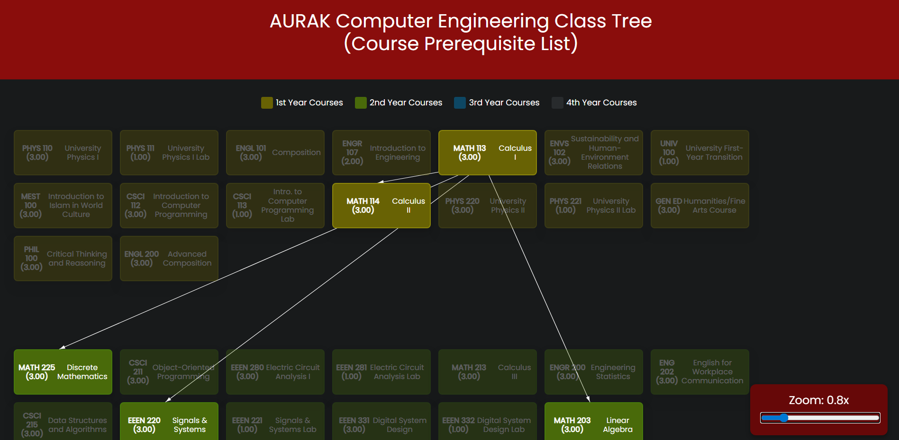

# AURAK Computer Engineering Prerequisite Tree
Interactive roadmap for AURAK's programs.

## Live Demo
https://abidzzz.github.io/aurak-course-tree

## Screenshots

## Features

- View all courses
- Hover to see prerequisites
- Hover to see corequisites

## License

This project is licensed under the **MIT License**.  

## Contributing

Contributions are welcome! If you have any suggestions or improvements, feel free to open an issue or submit a pull request.

## Acknowledgments

> Built upon initial work by [Ekrem Yilmaz](https://github.com/arifekrem).